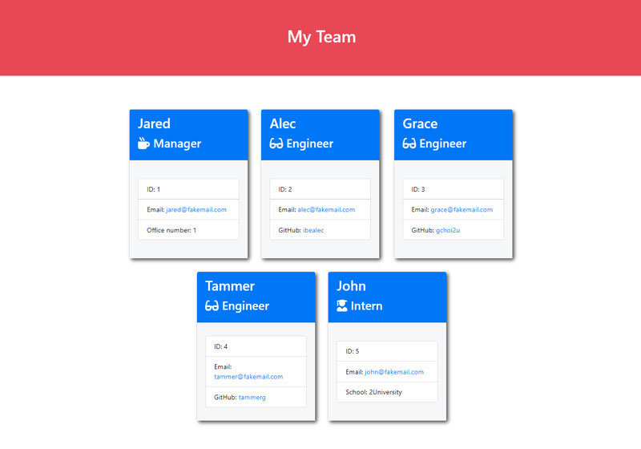

# Team_profile_generator

This application generates a webpage that displays basic information about team members in a software engineering team. The webpage includes the names, employee IDs, email addresses, and GitHub profiles (for engineers) or school names (for interns) for each team member.

# Functionality

This Node.js command-line application accepts user input and creates objects for each team member using the correct classes as blueprints. It prompts the user to enter the team manager's name, employee ID, email address, and office number. Then, the user is presented with a menu with the option to add an engineer or an intern, or to finish building the team. If the user selects the engineer option, they are prompted to enter the engineer's name, ID, email, and GitHub username. If the user selects the intern option, they are prompted to enter the intern's name, ID, email, and school name. Once the user finishes building the team, the HTML is generated and saved to a file named team.html in the output folder.

# Usage

To use this application, clone the repository onto your local machine. In the terminal, navigate to the root directory of the application and run the command node index.js. Follow the prompts to enter information about your team members. Once you have finished building the team, the team.html file will be generated in the output folder.

# License

This application is licensed under the MIT License.

